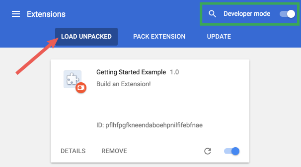

# Sri Lanka Covid-19 Statistics - Chrome Extension

Chrome extension developed for provides the current real time situation of the patients reported in Sri Lanka.

### Features

* Get Realtime Updated covid-19 data from realable source
* Get Covid Daily details within seconds without leaving your favourite website
* get more details by clicking source url

### How to Install as a Developer

The directory holding the manifest file can be added as an extension in developer mode in its current state.

1.  Open the Extension Management page by navigating to  `chrome://extensions`.
    -   The Extension Management page can also be opened by clicking on the Chrome menu, hovering over  **More Tools**  then selecting  **Extensions**.
2.  Enable Developer Mode by clicking the toggle switch next to  **Developer mode**.
3.  Click the  **LOAD UNPACKED**  button and select the extension directory.

### Credits

* Special thanks goes to https://hpb.health.gov.lk/

